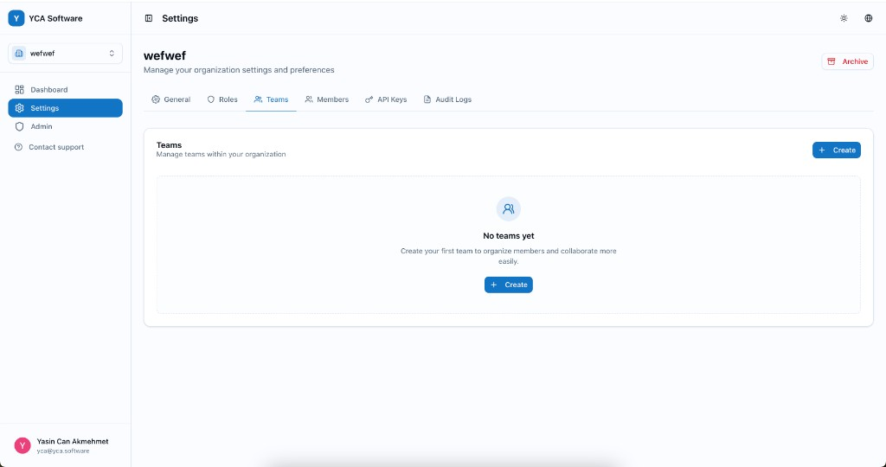
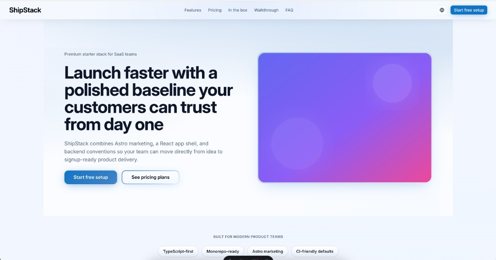

# 2chi-kit

Monorepo for reusable app foundations:

- `apps/go-api`: Go API backend
- `apps/react-spa`: React + Vite private/admin SPA
- `apps/astro`: Astro marketing site

## Visual preview

### React SPA settings experience



### Astro marketing hero experience



## App templates in detail

### `apps/go-api` - Backend API template

**Technologies**
- Go
- Echo (HTTP server/routing)
- PostgreSQL + Redis
- RabbitMQ (jobs/queues)
- Swagger/OpenAPI docs

**Included functionality**
- Authentication flows (email/password, token lifecycle, refresh token handling)
- Organization/team/member management building blocks
- Role and API key management patterns
- Billing/subscription integration hooks (Paddle)
- OAuth/integration hooks (Google)
- Background jobs, cron tasks, and queue-based processing
- Structured service/repository layering for scalable domain modules

### `apps/react-spa` - Private/admin web app template

**Technologies**
- React + Vite + TypeScript
- TanStack Query (server state)
- Zustand (client state)
- React Router
- i18next (translations)
- Tailwind CSS + `@yca-software/design-system`
- Vitest + Playwright

**Included functionality**
- Public + private/admin route structure
- Authentication-aware app shell and API integration patterns
- Settings and administration screens (users, teams, roles, API keys patterns)
- Reusable form and table-driven CRUD flows
- Locale-based copy management for product/admin UI
- Optional analytics and billing frontend integration points (PostHog/Paddle)

### `apps/astro` - Marketing site template

**Technologies**
- Astro
- React components/islands
- Tailwind CSS + `@yca-software/design-system`
- Biome linting

**Included functionality**
- SEO-ready static marketing pages
- Multi-language content structure (English/French by default)
- Shared SEO head component and canonical URL support
- Reusable marketing sections/components for landing pages
- Environment-driven site branding/contact configuration

## Quick start

1. Install dependencies:

   ```bash
   pnpm install
   ```

2. Start development tasks:

   ```bash
   pnpm dev
   ```

3. Run quality checks:

   ```bash
   pnpm lint
   pnpm build
   ```

## Personalize each app

Use the app-local `.env.example` files as your starting point, then replace placeholder values with your own project settings.

### `apps/go-api` (backend)

- Copy `apps/go-api/.env.example` to `.env`.
- Set project identity values like `APP_NAME`, `WEB_APP_URL`, and email sender fields.
- Configure infrastructure DSNs (`POSTGRES_DSN`, `REDIS_DSN`, `RABBITMQ_URL`) for your environment.
- Replace all token and integration placeholders (`TOKEN_*`, `GOOGLE_*`, `PADDLE_*`, `RESEND_API_KEY`) with your own credentials.

### `apps/react-spa` (web app)

- Copy `apps/react-spa/.env.example` to `.env`.
- Set `VITE_API_URL` to your API base URL and `VITE_APP_NAME` to your product/app name.
- Configure optional integrations (`VITE_OAUTH_GOOGLE_CLIENT_ID`, PostHog, Paddle) only if you use them.
- Update locale copy and branding text under `apps/react-spa/src/locales/`.

### `apps/astro` (marketing site)

- Copy `apps/astro/.env.example` to `.env`.
- Set `PUBLIC_SITE_URL`, `PUBLIC_SITE_NAME`, and `PUBLIC_CONTACT_EMAIL` for your public website.
- Update landing-page content in `apps/astro/src/i18n/locales/` and page sections in `apps/astro/src/components/`.

## Walkthrough

This is a practical local workflow to run the full kit and make your first customization.

1. Install dependencies from repo root:

   ```bash
   pnpm install
   ```

2. Create env files:
   - `cp apps/go-api/.env.example apps/go-api/.env`
   - `cp apps/react-spa/.env.example apps/react-spa/.env`
   - `cp apps/astro/.env.example apps/astro/.env`

3. Configure required environment variables before starting services:
   - `apps/go-api/.env`
     - Core app/runtime: `ENV`, `APP_NAME`, `WEB_APP_URL`, `SERVER_PORT`, `SERVER_CORS`
     - Infra DSNs: `POSTGRES_DSN`, `REDIS_DSN`, `RABBITMQ_URL`
     - Auth/token config: `TOKEN_ACCESS_SECRET`, `TOKEN_ACCESS_TTL`, `TOKEN_REFRESH_TTL`, `TOKEN_PASSWORD_RESET_TTL`, `TOKEN_INVITATION_TTL`, `TOKEN_EMAIL_VERIFICATION_TTL`
     - Mail/provider config: `RESEND_API_KEY`, `FROM_EMAIL`, `FROM_NAME`, `SUPPORT_INBOX_EMAIL`
     - Enable integrations only when needed: `GOOGLE_OAUTH_*`, `GOOGLE_MAPS_API_KEY`, `PADDLE_*`
   - `apps/react-spa/.env`
     - Required: `VITE_API_URL`, `VITE_APP_NAME`
     - Common local settings: `VITE_APP_ENV`, `VITE_APP_COOKIE_DOMAIN`
     - Optional integrations: `VITE_OAUTH_GOOGLE_CLIENT_ID`, `VITE_PUBLIC_POSTHOG_*`, `VITE_PADDLE_*`
   - `apps/astro/.env`
     - Required: `PUBLIC_SITE_URL`, `PUBLIC_SITE_NAME`, `PUBLIC_CONTACT_EMAIL`
     - Optional analytics: `PUBLIC_GA_MEASUREMENT_ID`

4. Start required local infrastructure (Postgres/Redis/RabbitMQ) via your preferred setup (for example Docker + compose under `infra/`).

5. Run the backend API:

   ```bash
   cd apps/go-api
   make run
   ```

6. In another terminal, run the React SPA:

   ```bash
   cd apps/react-spa
   pnpm dev
   ```

7. In another terminal, run the Astro marketing app:

   ```bash
   cd apps/astro
   pnpm dev
   ```

8. Make one branding pass:
   - Update `VITE_APP_NAME` in `apps/react-spa/.env`.
   - Update `PUBLIC_SITE_NAME` in `apps/astro/.env`.
   - Update API `APP_NAME` in `apps/go-api/.env`.

9. Validate before commit:

   ```bash
   pnpm lint
   pnpm build
   cd apps/go-api && make test
   ```

## Contributing

Contributions are welcome.

- Open an issue first for larger changes so we can align on direction.
- Create a feature branch and keep changes focused/small.
- Run checks before opening a PR:
  - `pnpm lint`
  - `pnpm build`
  - `cd apps/go-api && make test`
- Include context in your PR description: what changed, why, and how you tested it.
